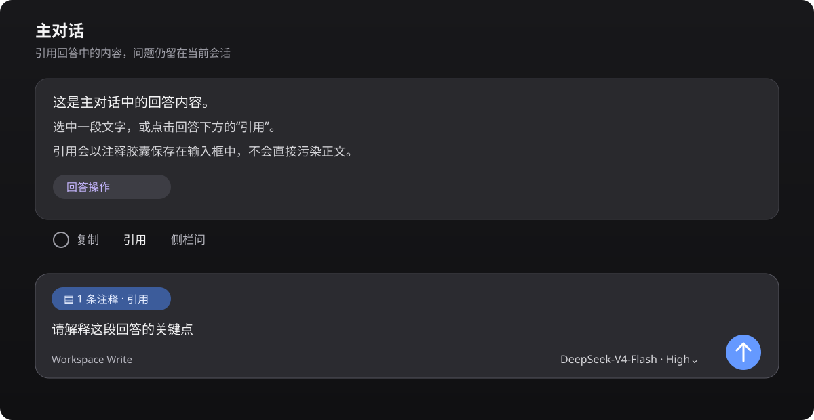
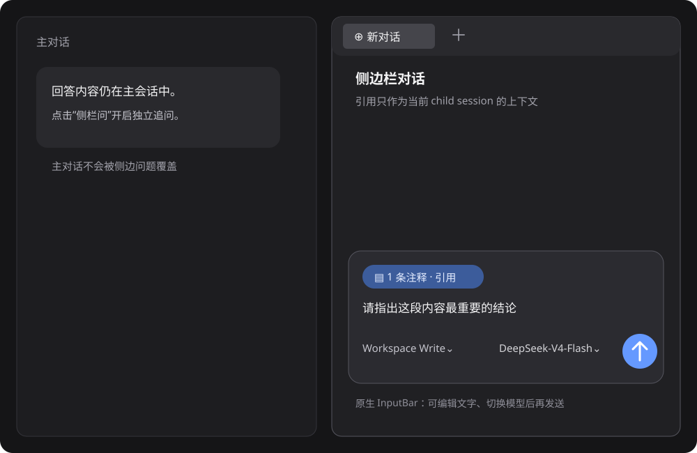

# dsh-harness-chat-control

[简体中文](README.md) · [English](README_EN.md) · [한국어](README_KO.md)

DSH Desktop の会話操作を ChatGPT に近づけるプラグインです。

> **目的：ChatGPT の 2 つの引用会話フローを再現すること。**
>
> 1. **メイン会話で引用**：回答を引用し、同じ会話でそのまま質問を続けます。
> 2. **サイドバー会話で引用**：引用を Better Sidebar に渡し、メイン会話を変更せず独立したサイドバーセッションで質問します。

## 画面例

### メイン会話での引用

回答の文字を選択するか、操作バーの **引用** をクリックします。引用は入力欄の注釈チップとして保持され、質問を編集してから送信できます。



### サイドバー会話での引用

**サイドバーで質問**、または文字選択ツールバーの **サイドバーチャットで質問** をクリックします。Better Sidebar の標準入力欄とモデル選択をそのまま使用します。引用チップ以外の文字はすべてユーザーが入力し、**送信** を押すまで回答は開始されません。



## 機能

- **メイン会話の引用**：回答全体または選択した一部を引用できます。`>` や `---` などの Markdown 記号が本文に混入しません。
- **標準の注釈チップ**：引用は入力欄の `1 件の注釈` チップとして表示され、送信前に質問を編集したりチップを削除したりできます。
- **標準のサイドバー入力欄**：Better Sidebar の `SideChatView` と DSH の `InputBar` を使用し、別のテキストボックスを作りません。メイン会話とサイドバー会話は独立しています。
- **モデル選択**：標準のモデル選択は現在のサイドバーセッションだけに適用されます。
- **編集して再送信**：ユーザーメッセージ横の鉛筆ボタンを押すと元の文章が標準入力欄に入り、送信後は同じ会話の元の位置で表示中の分岐を置き換えます。
- **生成の停止**：DSH の標準の停止・送信状態を利用し、イベントを二重送信しません。

このプラグインが追加するのは引用チップ、入口、セッションのルーティングだけです。入力欄、権限、モデルメニュー、回答表示は DSH Harness と Better Sidebar の標準コンポーネントが担当します。

## 対応バージョン

| コンポーネント | バージョン |
| --- | --- |
| DSH Desktop（Windows） | `0.7.2` |
| DeepSeek Harness / `@deepseek-ai/dsh` | `0.1.2-alpha.1` |
| `dsh-better-sidebar` | **`0.17.1`** |
| Node.js | `>=20` |
| pnpm | `10.x` または `11.x` |

`dsh-better-sidebar@0.18.x` は Harness `0.1.2-rc.1+` 向けで、alpha.1 に存在しない `connection.state.getSnapshot()` を読み取ります。DSH Desktop `0.7.2` では Sidebar を `0.17.1` に固定してください。固定しない場合、新しい会話を開くと `Cannot read properties of undefined (reading 'getSnapshot')` が発生することがあります。

## インストール

Windows PowerShell で、現在の安定版インストーラーを実行します。

```powershell
$script = (irm 'https://raw.githubusercontent.com/1985899182/dsh-harness-chat-control/v0.2.60/scripts/install.ps1').TrimStart([char]0xFEFF)
& ([scriptblock]::Create($script)) -Ref 'v0.2.60'
```

インストーラーはプラグインを DSH Desktop の `web` プロファイルに追加します。初回の世代インストール、またはプラグインが live でない場合は安全にステージングして、DSH Desktop の完全な再起動を案内します。すでに live のプラグインを更新するときだけ Web Client を HMR で同期し、その後ページを `Ctrl+R` で更新します。

インストール元は明示的な HTTPS Git URL です。pnpm が GitHub の短縮記法を SSH として解釈することはありません。インストーラーは `HTTP_PROXY`/`HTTPS_PROXY` 環境変数または WinINET のプロキシを確認し、pnpm、git、node の子プロセスへ渡します。明示的に指定することもできます。

```powershell
& ([scriptblock]::Create($script)) -Ref 'v0.2.60' -Proxy 'http://127.0.0.1:7897'
```

レジストリへの接続が遅い場合は、registry URL とリトライ回数を指定します。

```powershell
& ([scriptblock]::Create($script)) -Ref 'v0.2.60' -Registry 'https://registry.npmjs.org/' -FetchRetries 5
```

このコマンドはダウンロードしたスクリプトをメモリ上の `scriptblock` として実行するため、PowerShell の実行ポリシーを変更する必要はありません。`.ps1` として保存して直接実行する場合は `powershell -ExecutionPolicy Bypass -File` を使用してください。

プロファイルがすでに Sidebar `0.18.x` の場合は、先に次の互換修正を実行します。

```powershell
$desktopNode = 'D:\DSH\DSH Desktop\resources\app\node_modules\node\bin\node.exe'
$desktopDsh = 'D:\DSH\DSH Desktop\resources\app\node_modules\@deepseek-ai\dsh\lib\bin.js'
$env:DSH_HOME = "$env:APPDATA\dsh-desktop\harness"
& $desktopNode $desktopDsh plugin --profile web add --save-exact dsh-better-sidebar@0.17.1
```

その後、安定版インストーラーをもう一度実行してページを更新します。

dshmarket が HTTP 502 などのホットマウントエラーを返した場合、インストーラーはトークンを伏せた HTTP ステータスとレスポンス本文を表示し、コールドスタートが必要であることを案内します。プロキシのタイムアウトをインストール成功とは扱いません。

## 使い方

1. **メイン会話**：回答の操作バーで **引用** を押すか、文字を選択して **会話に追加** を選び、質問を入力して送信します。
2. **サイドバー会話**：**サイドバーで質問**、または選択ツールバーの **サイドバーチャットで質問** を押し、モデルを選んで質問を入力し、送信します。
3. **編集して再送信**：ユーザーメッセージ横の鉛筆ボタンを押し、標準入力欄で文章を編集して送信します。新しい回答は元の位置に表示されます。

## 開発

```powershell
npm test
```

マニフェスト、ローダー宣言、PowerShell インストーラー、JavaScript 構文を検証します。

## リリース

現在のマイルストーンは **`v0.2.60`** です。DSH Desktop `0.7.2` / Harness `0.1.2-alpha.1` で検証しています。DSH または Harness のメジャーバージョンを更新した場合は、標準 Slot と状態インターフェースを再確認してください。

## ライセンス

MIT
